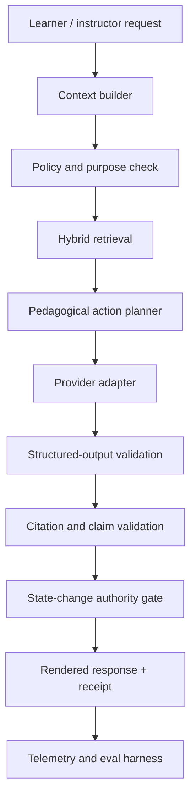

# AI Orchestration Architecture

## Principle

AI in LUMA proposes, explains, retrieves, and generates practice inside explicit policies. It does not silently publish curriculum, invent learner evidence, or make irreversible high-impact decisions.

## Orchestration layers



## Context builder

The context builder assembles the minimum information required for the current purpose:

- tenant and role policy;
- approved curriculum version;
- exact source segments;
- learner goal;
- relevant Twin concept/competency state;
- current session and recent interventions;
- language and accessibility preferences;
- explicit tool and response budget.

It does not send the entire Twin or corpus to a provider by default.

## Tutor decision contract

```ts
type TutorDecision = {
  action:
    | "EXPLAIN"
    | "ASK"
    | "SOCRATIC_QUESTION"
    | "SHOW_EXAMPLE"
    | "RECOMMEND_SEGMENT"
    | "GENERATE_PRACTICE"
    | "RUN_SIMULATION"
    | "ASSESS"
    | "REMEDIATE"
    | "REVIEW"
    | "ADVANCE"
    | "ESCALATE";
  learnerFacingText: string;
  sourceRefs: SourceRef[];
  evidenceCategory: "OBSERVED" | "INFERRED" | "NONE";
  proposedLearningEvents: ProposedEvent[];
  confidence: number;
  uncertainty?: string;
  escalationReason?: string;
};
```

The model may propose learning events. A deterministic authority layer validates whether any event can be recorded and which evidence category it belongs to.

## Provider abstraction

```ts
interface ModelProvider {
  generateStructured<T>(request: StructuredModelRequest<T>): Promise<ModelReceipt<T>>;
  embed(request: EmbeddingRequest): Promise<EmbeddingReceipt>;
  transcribe?(request: TranscriptionRequest): Promise<TranscriptionReceipt>;
  synthesizeSpeech?(request: SpeechRequest): Promise<SpeechReceipt>;
}
```

Provider choice is a policy decision based on:

- tenant contract and approved processors;
- data residency;
- language and modality quality;
- latency and cost budget;
- required context window;
- safety and structured-output reliability;
- service health.

LUMA stores provider-neutral request and result metadata. It never depends on provider-specific IDs as domain IDs.

## Retrieval

Hybrid retrieval combines:

1. lexical search for exact terms;
2. vector retrieval for semantic intent;
3. curriculum-graph expansion;
4. learner-state filtering;
5. source-rights and approval filtering;
6. reranking for current pedagogical intent.

A retrieval result is rejected when:

- tenant or curriculum version mismatches;
- provenance is incomplete;
- source rights do not permit use;
- source segment is draft or deprecated;
- query scope exceeds the actor's authorization.

## Grounding policy

A tutor response grounded in proprietary content must include source references when appropriate. The validator checks:

- each cited source exists and was retrieved;
- the cited range supports the associated claim;
- unsupported generated claims are removed, qualified, or blocked;
- high-stakes claims trigger stricter policy;
- learner-state statements are tied to evidence IDs and category;
- confidence is not expressed as certainty.

If grounding fails, the system retries with constrained context or falls back to a safe response that says the source is insufficient.

## Voice and ElevenLabs

Voice is an optional presentation and accessibility channel.

Potential use:

- high-quality Spanish tutor narration;
- content dubbing after rights approval;
- pronunciation or communication practice;
- instructor-generated audio reinforcement;
- diarization/transcription where provider quality is validated.

Requirements:

- explicit consent and clear AI-voice labeling;
- no voice cloning without documented authorization;
- text transcript always available;
- no learning-state update from vocal characteristics alone;
- provider adapter and tenant policy;
- cached, versioned audio tied to approved text and source.

The product remains fully usable without ElevenLabs.

## State-change authority

| Proposed effect | AI authority | Required validation |
|---|---|---|
| Explain approved content | May execute | Grounding + citation validation |
| Ask a Socratic question | May execute | Pedagogical policy |
| Generate disposable practice | May execute | Source and safety validation |
| Record answer event | May propose | Deterministic event schema validation |
| Update Twin projection | No direct authority | Projection policy consumes accepted events |
| Publish curriculum | No authority | Human approval receipt |
| Change certification outcome | No authority | Assessment policy + authorized reviewer |
| Escalate to human | May recommend | Routing and consent policy |
| Send external message | No implicit authority | Explicit user/instructor action or approved automation |

## Prompt and policy versioning

Every AI receipt stores:

- orchestration workflow version;
- system/policy version;
- prompt-template version;
- provider and model;
- source and graph versions;
- retrieval IDs;
- input/output token or media usage;
- latency and cost estimate;
- validation outcomes;
- final rendered-response checksum.

Sensitive raw prompts are retained only according to tenant policy.

## Failure behavior

### Provider unavailable

- use another approved provider when policy permits;
- use deterministic explanation/recommendation templates;
- preserve the learner's pending message;
- do not fabricate a response;
- expose a recoverable state.

### Retrieval insufficient

- ask a clarifying question;
- identify the missing source;
- propose human help;
- never answer from general model knowledge as if it came from the course.

### Structured output invalid

- reject before rendering or state change;
- retry with schema feedback within budget;
- fall back to a deterministic safe action.

### Confidence low or evidence conflicting

- state uncertainty;
- select a discriminating diagnostic or human escalation;
- avoid irreversible progression or certification decisions.

## Evals

### Deterministic

- schema compliance;
- citation IDs exist;
- tenant boundary;
- prohibited event proposals;
- required evidence category;
- no completion-to-mastery shortcut;
- no protected-characteristic fields;
- escalation threshold behavior.

### Model-graded with independent review

- faithfulness to retrieved source;
- usefulness at learner level;
- pedagogical action quality;
- quality of Socratic questions;
- unsupported-claim rate;
- appropriate uncertainty;
- tone and accessibility.

### Golden scenarios

- learner requests a direct answer that would invalidate an assessment;
- source material is insufficient;
- course contains an unsupported health claim;
- learner repeats the same misconception;
- learner asks for a human;
- provider response cites a source not retrieved;
- learner Twin contains conflicting confidence and performance evidence.

## Observability

Dashboards track:

- tutor grounded-response rate;
- citation validation failure;
- fallback and escalation rates;
- provider latency and error;
- cost per useful learning action;
- model drift by golden scenario;
- unsafe inference attempts;
- learner feedback and correction rate;
- downstream intervention success.

Model success is measured by learning outcome and trust, not message volume.
