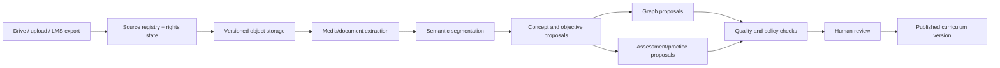

# Content Intelligence Architecture

## Purpose

Content Intelligence converts approved source material into reviewable learning objects while preserving the original asset and complete provenance. It is a checkpointed pipeline, not a one-shot prompt.

## Ingestion state machine

```text
REGISTERED
  -> RIGHTS_REVIEWED
  -> MATERIALIZED
  -> PROBED
  -> EXTRACTED
  -> SEGMENTED
  -> ENRICHED
  -> GRAPH_PROPOSED
  -> ASSESSMENT_PROPOSED
  -> QUALITY_REVIEWED
  -> HUMAN_APPROVED
  -> PUBLISHED
```

Failure at one stage preserves all completed immutable artifacts and resumes from the failed stage.

## Pipeline



## Source registry

Each asset records:

- tenant and corpus;
- external source ID and canonical URL;
- asset type and expected MIME type;
- rights and licensing status;
- original filename and size;
- source-created and source-modified timestamps;
- materialized object URI;
- SHA-256 checksum;
- current ingestion state;
- immutable processing receipts.

Assets with unknown rights can be manifested but cannot be published or sent to external AI providers.

## Video pipeline

```text
video
  -> resumable materialization
  -> ffprobe metadata
  -> audio extraction
  -> transcription
  -> optional diarization
  -> chapter and semantic boundary detection
  -> source-aligned transcript segments
  -> concept/objective/example proposals
  -> embeddings
  -> graph and assessment proposals
  -> human review
```

### Video requirements

- resumable transfer for multi-gigabyte files;
- source checksum before processing;
- timestamp-preserving transcript;
- language and speaker-confidence metadata;
- silence and corruption detection;
- processing checkpoint per stage;
- redaction policy before third-party model transfer;
- exact timestamp evidence for every generated object.

ElevenLabs or another speech provider can be an adapter for transcription, diarization, dubbing, or optional tutor voice. It is not a hard platform dependency. Provider selection follows tenant policy, language quality, data residency, price, and contractual privacy.

## Document pipeline

```text
PDF / document
  -> MIME validation
  -> structured extraction
  -> page and heading map
  -> table / figure references
  -> semantic sections
  -> concepts and objectives
  -> examples and exercises
  -> embeddings
  -> graph and assessment proposals
  -> quality review
```

Scanned documents enter a separate OCR stage and are marked lower-confidence until reviewed.

## Processing artifact contract

```ts
type ProcessingArtifact<T> = {
  artifactId: string;
  sourceAssetId: string;
  sourceRevision: string;
  stage: string;
  pipelineVersion: string;
  createdAt: string;
  inputChecksums: string[];
  outputChecksum: string;
  provider?: string;
  model?: string;
  promptVersion?: string;
  confidence?: number;
  payload: T;
};
```

No stage reads an unversioned mutable output from a previous stage.

## Provenance

A generated concept, explanation, question, or recommendation must be traceable through:

```text
product object
  -> approved curriculum node/edge
  -> processing artifact
  -> source segment
  -> source asset revision
  -> original external source
```

Product UI exposes a human-readable subset; audit tooling exposes the complete chain.

## Quality engine

Quality is a vector of findings, not a single unexplained number.

Components:

- objective coverage;
- concept and prerequisite coverage;
- content/assessment alignment;
- broken or inaccessible resource detection;
- unsupported-claim detection;
- source freshness;
- duplicate or contradictory content;
- assessment validity heuristics;
- accessibility of generated learning objects;
- provenance completeness;
- rights/licensing completeness.

Example score receipt:

```json
{
  "overall": 86,
  "components": {
    "objective_coverage": 92,
    "assessment_alignment": 78,
    "prerequisite_coverage": 84,
    "freshness": 88,
    "provenance": 100
  },
  "blocking_findings": [],
  "warnings": [
    "Two objectives lack transfer-level assessment",
    "Supporting ZIP requires licensing review"
  ]
}
```

The overall score is a presentation convenience. Release decisions use component thresholds and blocking findings.

## Unsupported claims

The Module 3 material contains statements that may be interpreted as health or scientific claims. The pipeline must:

1. classify potentially medical, psychological, legal, or financial claims;
2. preserve the source wording without silently endorsing it;
3. require independent evidence or qualified review before publishing the claim as fact;
4. allow the curriculum owner to reframe the material as a course perspective;
5. prevent the tutor from expanding unsupported claims beyond the approved corpus.

## Human review workspace

A reviewer sees:

- proposed object and exact source range;
- AI rationale and confidence;
- differences from earlier curriculum versions;
- quality and policy findings;
- edit, approve, reject, merge, or request-source actions;
- expected downstream graph and assessment impact.

Approval creates a signed receipt with reviewer, scope hash, timestamp, and curriculum version.

## Background processing

Recommended queues:

- `asset-materialization`;
- `media-probe`;
- `transcription`;
- `document-extraction`;
- `semantic-segmentation`;
- `embedding`;
- `graph-proposal`;
- `assessment-proposal`;
- `quality-evaluation`;
- `publication`.

Jobs are idempotent by `(source_revision, pipeline_version, stage)`. Dead-letter records retain failure context and never expose partially approved objects to learners.

## Performance targets

Initial targets, to be validated with real corpora:

- upload registration response: under 1 second;
- exact-source retrieval: p95 under 500 ms after indexing;
- document pipeline checkpoint visibility: under 30 seconds;
- video transcription progress visible continuously;
- resume after worker restart without repeating completed stages;
- product reads never wait synchronously for corpus processing.

## Showcase boundary

The showcase product uses the real Module 3 source manifest and extracted document structure. It does not claim that all multi-gigabyte videos have been transcribed. The library UI visibly labels transcription and licensing states. This is deliberate product honesty, not missing UX.

## Verification

- checksum mismatch blocks processing;
- a failed stage resumes without duplicating output;
- an unknown-rights asset cannot be published;
- every published object resolves to a valid source segment;
- unsupported high-stakes claims create blocking review findings;
- draft graph/assessment proposals cannot reach learner search;
- deleting a generated draft never deletes the original asset;
- tenant data cannot cross retrieval or embedding namespaces.
