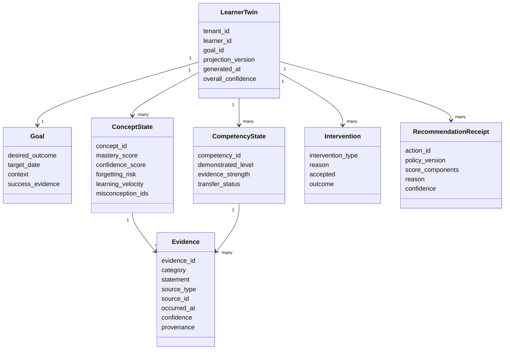
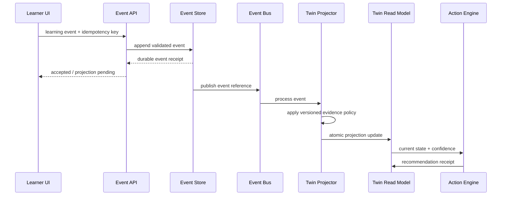

# Learner Digital Twin Architecture

## Purpose

The Learning Twin is a persistent, explainable representation of what the platform currently believes about a learner's progress toward a goal. It is not a personality profile, a psychological diagnosis, a surveillance record, or an immutable score.

## Design invariant

```text
Historical evidence is append-only.
The Twin is a rebuildable projection.
Inference is never stored as fact.
```

## Conceptual model



## Evidence categories

### Observed

Created from a verifiable event or result.

Examples:

- selected an answer;
- completed a simulation;
- retrieved a concept after 72 hours;
- requested a source segment;
- instructor recorded an intervention outcome.

Observed does not mean infallible. It means the event happened; interpretation can still be uncertain.

### Self-reported

Information intentionally provided by the learner.

Examples:

- goal;
- available time;
- confidence;
- prior experience;
- correction to a Twin inference.

Self-reported evidence is not lower status by default. It answers a different question than performance evidence.

### Inferred

A bounded hypothesis derived from evidence.

Examples:

- likely misconception;
- low fluency under pressure;
- forgetting risk;
- recommended intervention.

Every inference stores:

- confidence;
- evidence IDs;
- rule/model version;
- generated timestamp;
- expiration or review condition;
- prohibited-use classification;
- human or learner correction history.

## Proposed relational schema

```sql
create table learning_event (
  event_id uuid primary key,
  tenant_id uuid not null,
  learner_id uuid not null,
  event_type text not null,
  occurred_at timestamptz not null,
  idempotency_key text not null,
  source_context jsonb not null,
  payload jsonb not null,
  schema_version text not null,
  unique (tenant_id, idempotency_key)
);

create table evidence_record (
  evidence_id uuid primary key,
  tenant_id uuid not null,
  learner_id uuid not null,
  concept_id uuid,
  competency_id uuid,
  category text not null check (category in ('OBSERVED','SELF_REPORTED','INFERRED')),
  statement text not null,
  confidence numeric(4,3) not null check (confidence between 0 and 1),
  source_event_ids uuid[] not null,
  provenance jsonb not null,
  policy_version text not null,
  occurred_at timestamptz not null,
  expires_at timestamptz
);

create table twin_projection (
  tenant_id uuid not null,
  learner_id uuid not null,
  goal_id uuid not null,
  projection_version bigint not null,
  projection jsonb not null,
  source_event_sequence bigint not null,
  generated_at timestamptz not null,
  primary key (tenant_id, learner_id, goal_id)
);

create table twin_correction (
  correction_id uuid primary key,
  tenant_id uuid not null,
  learner_id uuid not null,
  target_evidence_id uuid,
  target_projection_path text not null,
  learner_statement text not null,
  created_at timestamptz not null,
  resolution text,
  resolved_at timestamptz
);
```

## Event-to-projection flow



## Projection policies

The showcase uses deterministic scoring in `src/lib/learning-engine.ts`. Production policies should remain versioned, testable, and explainable.

Example evidence weights are illustrative, not fixed:

| Evidence | Typical effect | Guardrail |
|---|---|---|
| Correct novel-scenario response | Increase application evidence | Require sufficient task validity |
| Correct same-question retry | Small increase | Do not treat memorization as transfer |
| Completed video | Exposure only | Never update mastery by itself |
| Low confidence + correct answer | Add calibration evidence | Do not label anxiety or personality |
| Repeated failure after remediation | Lower confidence / escalate | Preserve prior positive evidence |
| Instructor observation | Add observed evidence | Require scoped role and source note |

## Confidence and conflict

When evidence conflicts:

1. preserve both records;
2. lower projection confidence;
3. prefer a diagnostic action that can discriminate between hypotheses;
4. explain the conflict to the learner when appropriate;
5. escalate to a human if high-impact decisions remain uncertain.

The system does not silently average away contradictions.

## Correction model

A learner correction is stored as self-reported evidence and linked to the challenged inference. The original inference remains auditable but can be superseded in the projection.

A correction can trigger:

- immediate projection rebuild;
- a neutral verification task;
- instructor review when required;
- policy or model quality feedback.

## Deletion and export

### Export

Export includes:

- goals and preferences;
- evidence records with category;
- current projections and confidence;
- recommendation receipts;
- correction history;
- source and policy versions.

### Deletion

Deletion is implemented by tenant policy and legal basis:

- revoke active access immediately;
- cryptographically or physically delete direct identifiers and learner-owned records;
- propagate deletion to model providers and analytics systems where applicable;
- retain only legally required, minimized audit records;
- rebuild cohort aggregates to prevent re-identification where feasible.

## Safety policy

The Twin must never infer or optimize on protected characteristics, political beliefs, religion, medical diagnoses, sexuality, or other sensitive traits unless a narrowly defined lawful educational accommodation explicitly requires user-provided data and policy review.

The Twin cannot be used to:

- manipulate urgency or price;
- penalize a learner without human review;
- silently alter certification standards;
- make employment, credit, insurance, or legal decisions;
- disclose unrelated learner context to instructors or organizations.

## Evaluation requirements

- deterministic event replay produces the same projection;
- stale or duplicate events do not double-count evidence;
- completion without assessment does not create mastery;
- inference always includes confidence and provenance;
- correction is visible and changes the projection policy path;
- export matches the learner-visible Twin;
- prohibited fields and inferences are rejected;
- projection rollback does not mutate the event ledger.
