# Curriculum Knowledge Graph

## Purpose

The curriculum graph turns source material into an inspectable model of what a learner can know, practice, demonstrate, and transfer. It allows LUMA to compare current capability with a target capability and to select actions at concept-level precision.

Files and modules remain provenance containers. They are not the graph's organizing principle.

## Core node types

| Node | Purpose | Examples in Module 3 |
|---|---|---|
| `Concept` | A unit of meaning | P.A.S., emotional management, logical levels |
| `Competency` | A demonstrable capability | Identify a sabotaging thought in context |
| `Goal` | Learner outcome | Transform a limiting belief using evidence |
| `LearningObject` | Explain, demonstrate, practice, or assess | PDF section, video segment, scenario |
| `AssessmentItem` | Elicit evidence | Novel scenario multiple-choice item |
| `Misconception` | Recurrent incorrect model | Confusing an emotion with the thought that precedes it |
| `SourceAsset` | Immutable provenance | Module 3 PDF, class 2 MP4 |
| `SourceSegment` | Addressable evidence range | Page range or timestamp |
| `CurriculumVersion` | Approved graph snapshot | Practitioner M3 v1 |

Learners are not graph nodes in the shared curriculum graph. Learner-to-concept state lives in the Learner State bounded context and references graph IDs.

## Relationship types

```text
Concept       --PREREQUISITE_OF--> Concept
Concept       --COMPOSES---------> Competency
Goal          --REQUIRES---------> Competency
LearningObject--TEACHES----------> Concept
LearningObject--DEMONSTRATES-----> Concept
LearningObject--PRACTICES--------> Competency
AssessmentItem--ASSESSES---------> Concept | Competency
AssessmentItem--DETECTS----------> Misconception
Misconception --CONCERNS---------> Concept
SourceSegment --SUPPORTS---------> LearningObject | Concept
SourceAsset   --CONTAINS---------> SourceSegment
Concept       --RELATED_TO-------> Concept
Concept       --CONTRASTS_WITH---> Concept
```

Every semantic edge includes provenance and approval state.

## Example Module 3 graph

```mermaid
flowchart LR
  G["Goal: transform a limiting belief"]
  C1["Communication between thought and emotion"]
  C2["P.A.S."]
  C3["Logical levels"]
  C4["Beliefs and values"]
  K1["Competency: identify an automatic thought"]
  K2["Competency: select the intervention level"]
  K3["Competency: formulate a testable alternative belief"]
  P1["Practice: meeting-feedback scenario"]
  A1["Assessment: novel workplace scenario"]
  M1["Misconception: emotion = thought"]
  S1["PDF segment: communication / P.A.S."]
  S2["PDF segment: logical levels"]

  C1 -->|prerequisite| C2
  C2 -->|prerequisite| C4
  C3 -->|prerequisite| C4
  C2 --> K1
  C3 --> K2
  C4 --> K3
  G --> K1
  G --> K2
  G --> K3
  P1 -->|practices| K1
  A1 -->|assesses| K1
  A1 -->|detects| M1
  S1 -->|supports| C1
  S1 -->|supports| C2
  S2 -->|supports| C3
```



## Node contract

```ts
type GraphNode = {
  id: string;
  tenantId: string;
  curriculumVersionId: string;
  type:
    | "concept"
    | "competency"
    | "goal"
    | "learning_object"
    | "assessment_item"
    | "misconception"
    | "source_asset"
    | "source_segment";
  canonicalLabel: string;
  description: string;
  status: "draft" | "reviewed" | "approved" | "deprecated";
  provenance: ProvenanceRef[];
  createdBy: "human" | "ai_proposal" | "import";
  confidence?: number;
  metadata: Record<string, unknown>;
};
```

## Edge contract

```ts
type GraphEdge = {
  id: string;
  tenantId: string;
  curriculumVersionId: string;
  fromNodeId: string;
  toNodeId: string;
  relationType: string;
  status: "draft" | "reviewed" | "approved" | "deprecated";
  provenance: ProvenanceRef[];
  rationale?: string;
  confidence?: number;
  createdBy: "human" | "ai_proposal" | "import";
};
```

AI-proposed nodes and edges are never queryable as approved curriculum until reviewed.

## Storage abstraction

The graph API must not force an early vendor lock-in.

```ts
interface CurriculumGraphRepository {
  getConcept(id: string, version: string): Promise<ConceptNode | null>;
  getPrerequisites(id: string, version: string): Promise<ConceptNode[]>;
  getGoalRequirements(goalId: string, version: string): Promise<CompetencyNode[]>;
  getLearningObjectsForConcept(
    conceptId: string,
    intent: "explain" | "practice" | "assess" | "review",
    version: string,
  ): Promise<LearningObjectNode[]>;
  getEvidencePath(nodeId: string, version: string): Promise<ProvenanceRef[]>;
  publishVersion(draftVersionId: string, approval: ApprovalReceipt): Promise<string>;
}
```

Initial production options:

1. PostgreSQL adjacency tables plus recursive CTEs;
2. PostgreSQL with graph projection/cache;
3. managed graph database behind the same interface when relationship traversal demands it.

For the first commercial deployment, PostgreSQL is sufficient and operationally simpler unless the graph exceeds query/performance thresholds measured in production.

## Versioning

A curriculum version is immutable after publication.

```text
Draft graph
  -> automated validation
  -> expert review
  -> approval receipt
  -> published immutable version
  -> learner journeys pin or migrate explicitly
```

A learner recommendation stores the curriculum version used. Updating a prerequisite cannot retroactively rewrite why an older recommendation was made.

## Graph validation rules

- no cycles in strict prerequisite relationships;
- every published concept has at least one provenance source;
- every competency has at least one valid demonstration or assessment path;
- assessment items reference approved concepts/competencies;
- deprecated nodes cannot be introduced into new journeys;
- no orphan learning object is published;
- source segment boundaries resolve to an existing asset revision;
- AI confidence alone cannot satisfy approval;
- duplicate concepts are merged only with human review and alias preservation.

## Gap computation

```text
required competencies for goal
  MINUS
competencies supported by sufficient learner evidence
  PLUS
weak prerequisites and retention risk
  EQUALS
ranked learning gaps
```

A gap record contains:

- target competency;
- supporting concepts;
- missing or weak evidence;
- prerequisite blockers;
- confidence;
- candidate learning objects;
- human-escalation condition.

## Search

Semantic search is graph-aware:

1. embed the learner query and retrieve candidate segments;
2. map candidates to approved concepts;
3. expand prerequisites and related misconceptions;
4. filter by learner goal and Twin state;
5. return exact source segment, explanation, and candidate practice;
6. expose the evidence path.

Search cannot return an unapproved AI-generated concept as if it were part of the source curriculum.

## Evaluation

Golden graph cases:

- prerequisite cycles are rejected;
- a source segment can be traced from recommendation to original asset;
- a learner with mastered prerequisites can reach an advanced practice;
- a learner with weak prerequisites is not routed to the downstream assessment;
- deprecated content is excluded from new recommendations;
- published graph versions are immutable;
- semantic retrieval respects tenant and curriculum version boundaries.
