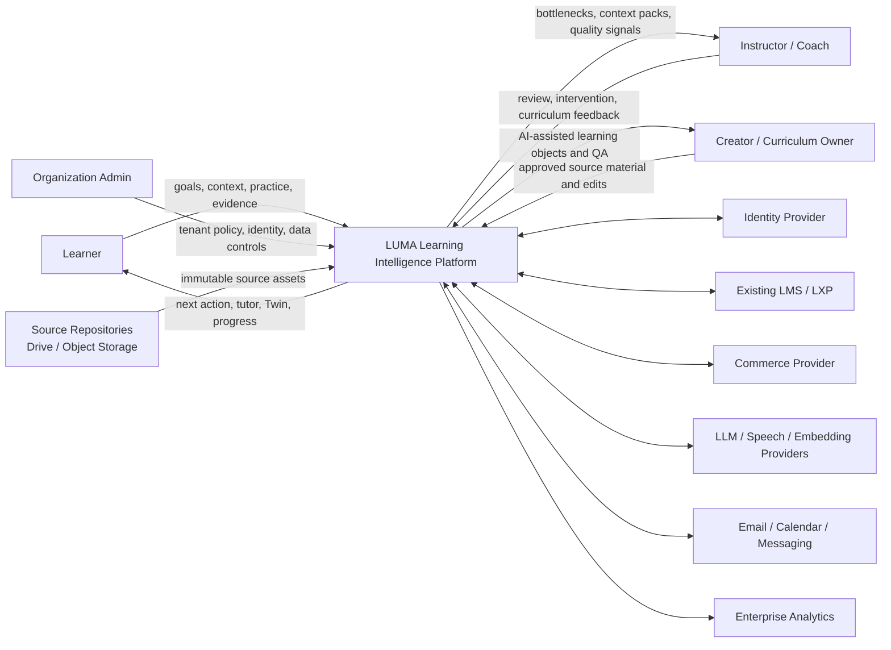
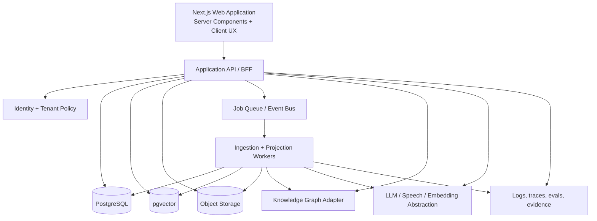

# LUMA System Context

## Objective

LUMA is a provider-portable Learning Intelligence Platform whose source of truth is learner evidence and curriculum provenance—not a page hierarchy.

The architecture must support a polished client-facing product today while preserving the boundaries required for production authentication, corpus ingestion, commerce, enterprise tenancy, and external LMS integration.

## Context diagram

## Bounded contexts

### Identity and tenancy

Responsibilities:

- users, organizations, memberships, roles;
- SSO / social login / enterprise identity;
- tenant isolation and policy;
- consent and learner data controls.

Does not own goals, mastery, curriculum, or payment state.

### Content

Responsibilities:

- immutable source assets;
- asset manifests, checksums, versioning, rights status;
- source locations, page/timestamp ranges;
- approved and draft learning objects.

Does not own learner state.

### Curriculum graph

Responsibilities:

- concepts, competencies, goals, prerequisites;
- taught-by, practiced-by, assessed-by, and demonstrated-by relationships;
- graph version and approval state.

Does not store raw behavioral history.

### Learner state

Responsibilities:

- learner goals and context;
- observed, inferred, and self-reported evidence;
- concept and competency projections;
- confidence, retention, misconception, and intervention state;
- export and correction history.

Historical evidence is append-only. Current Twin state is a rebuildable projection.

### AI orchestration

Responsibilities:

- provider abstraction;
- structured tutor decisions;
- retrieval, grounding, citation validation;
- content transformation proposals;
- safety and policy checks;
- model/prompt/version telemetry.

AI orchestration never grants itself curriculum publication or high-impact learner-state authority.

### Recommendation

Responsibilities:

- generate and rank candidate learning actions;
- apply policy, time, prerequisite, and confidence constraints;
- expose recommendation reasons and alternatives;
- record acceptance and outcome.

### Learning analytics

Responsibilities:

- verified progress and cohort projections;
- curriculum bottlenecks and misconceptions;
- intervention-effect estimates;
- quality score components;
- privacy-preserving operational exports.

### Commerce

Responsibilities:

- entitlements, checkout, subscription, refund, coupon, scholarship, and license state;
- payment-provider adapters.

Commerce may grant access. It cannot change mastery, recommendations, or curriculum state.

## Runtime topology

For the showcase release, the Next.js application contains deterministic domain fixtures and a structured tutor adapter so the complete UX can be demonstrated without fake dead-end controls. The production seams are explicit:

- `src/lib/learning-engine.ts` becomes a versioned recommendation service or shared domain package;
- `src/lib/luma-data.ts` becomes repository queries and read models;
- `/api/tutor` becomes an orchestration endpoint with retrieval, policy, and provider adapters;
- browser-local learning events become authenticated, append-only server events;
- source URLs become object and provenance records.

## Multi-tenancy and authorization

Suggested roles:

- `owner` — organization, policy, billing, export;
- `admin` — users, cohorts, content approval;
- `instructor` — learner context, interventions, analytics;
- `creator` — source ingestion and curriculum proposals;
- `learner` — own journey, Twin, correction and export;
- `auditor` — read-only provenance, policy, and evidence.

Every server query is scoped by both `tenant_id` and authorized subject. Learner context packs apply purpose limitation and expose only evidence needed for the intervention.

## Data ownership

| Record | Authoritative owner | Mutation model |
|---|---|---|
| Source asset | Content | Immutable version + new revision |
| Curriculum relationship | Curriculum graph | Draft → reviewed → approved |
| Learning event | Learner state | Append-only |
| Twin projection | Learner state | Rebuildable, versioned |
| Recommendation | Recommendation | Immutable decision receipt |
| Tutor response | AI orchestration | Immutable response + evidence receipt |
| Entitlement | Commerce | Provider-synchronized state |
| Quality finding | Learning analytics | Versioned observation |

## Reliability model

- User writes receive an idempotency key.
- Learning events are committed before asynchronous projections.
- The UI can show a pending projection without claiming final mastery.
- Workers use checkpointed, idempotent stages.
- A failed AI call cannot erase source data or learner evidence.
- Provider outages degrade to deterministic recommendations, cached retrieval, or human escalation.
- Projection versions make rollback possible without editing event history.

## Security and privacy baseline

- encrypted transport and managed encryption at rest;
- tenant-scoped authorization on every read and write;
- no model-provider training on proprietary corpus or Twin data unless contractually enabled;
- secret isolation and provider-specific service accounts;
- evidence and inference audit trail;
- export, correction, and deletion workflows;
- retention policy per evidence class;
- prohibited inference policy for protected characteristics;
- AI output validation before state-changing effects.

## Deployment environments

- **local/showcase** — deterministic fixtures, real UI, real interaction flows, source links;
- **preview** — isolated deployment per branch, seeded demo tenant, no production data;
- **staging** — production topology, synthetic and approved test corpus;
- **production** — tenant isolation, SSO, queues, object storage, monitoring, backup, data governance.

No preview deployment receives production credentials by default.
