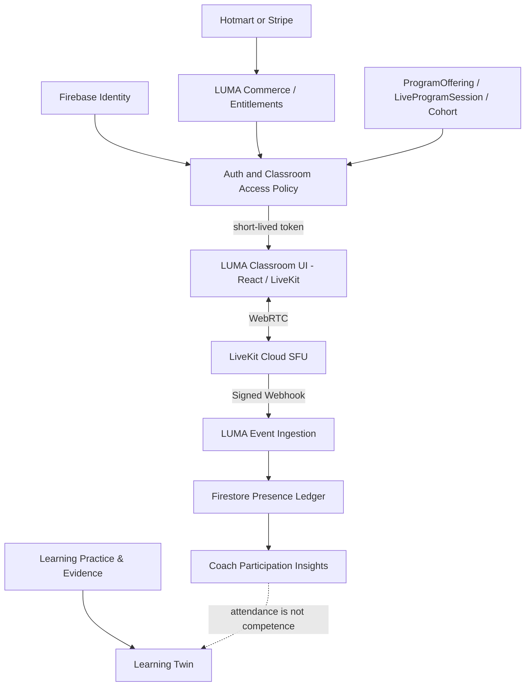

# LUMA Live Classroom — Enterprise Architecture & Operations

**Owner:** LUMA Platform Engineering  
**Status:** Implementation branch / not yet production-enabled  
**Decision:** ADR-LIVE-001 — LiveKit Cloud as the media engine behind LUMA's session and entitlement boundary.  
**Updated:** 2026-10-09

## 1. Business capability and non-goals

Seres de Excelencia may use Hotmart for checkout and use LUMA for identity, program enrollment, live classrooms, practice and progress. A learner stays in the LUMA domain for scheduled, instructor-led training and does not need to open Zoom. Sessions may be strictly unrecorded.

- LUMA owns tenant, program, cohort, authoritative session, enrollments, role policy, room admission, verified attendance, learning evidence and coaching insights.
- LiveKit Cloud owns SFU/WebRTC real-time media transport, data chat, camera, audio, network recovery and screen-share delivery.
- Commerce providers grant/revoke enrollments; they never mint or store LiveKit tokens.
- Out of scope of this first integration commit: advanced event production, breakout rooms, compliance-grade transcript/recording retention, virtual stage streaming, SSO between enterprises and automatic competency assessment. These require separate reviewed contracts.
- Recording setting `none` means **LUMA does not schedule provider recording/egress**; it does not technically prevent a learner from making a local screen recording.

## 2. Solution boundaries



Persisted paths:
- `programOfferings/{offeringId}`, `programOfferings/{offeringId}/sessions/{sessionId}` — existing source of truth; `classroomProvider: "livekit" | "external"` with `classroomCapacity`.
- `commerceEnrollments/{entitlementId}` — existing grant/revocation/expiry record.
- `liveClassroomRooms/{sha256-room-name}` — immutable room-to-tenant/cohort binding.
- `liveClassroomRooms/{roomName}/authorized/{hashedIdentity}` — UID, session role, issued time and optional moderator `bannedAt`.
- `liveClassroomRooms/{roomName}/attendance/{hashedIdentity}` — connectionCount, joined/left timestamps and completed attendedSeconds; `events/{webhookEventId}` raw, idempotently ingested events.

A room name hashes `[tenantId, offeringId, sessionId]` to prevent recognizable tenant names in the media service. A LiveKit participant identity separately hashes `[roomName, firebaseUid]`. Neither original identity nor commerce email is embedded in a LiveKit room/participant ID.

## 3. AuthZ and threat model

1. Browser sends a Firebase ID token via `Authorization: Bearer ...`; server verifies token. Anonymous callers receive 401.
2. Server directly loads the exact offering and session. A learner is admitted **only** when their active, non-expired, claimed enrollment matches tenantId + programId + offeringId + learnerId. A coach is admitted only if explicitly assigned in `coachIds` **and** has verified coach claim. Global admin/superuser claims authorize instructors.
3. Session must be scheduled, offering active and live/hybrid, provider `livekit`, and current time between 30 minutes before start and 30 minutes after scheduled end.
4. Backend creates/reuses the room, registers the participant and issues a room-scoped, 10-minute **joining token**. A distributed Firestore quota limits each room identity to **24 tokens per 15 minutes**, with at least 2 seconds between issuance attempts. A learner may publish microphone/camera, instructor also publishes screen-share sources. No client tokens have roomAdmin, roomCreate or roomRecord.
5. A coach can remove a participant through an authenticated server moderation endpoint. The policy persists a ban in the authorized roster before using LiveKit Cloud's removeParticipant token revocation. Subsequent LUMA token requests reject banned identities. Instructor unlock is a separately auditable future capability, not automatic.
6. Webhooks must have a valid LiveKit provider signature over the exact raw payload; data ingestion accepts only authorized pseudonymous identities in known LUMA rooms. Duplicate provider IDs are idempotent, and out-of-order timestamps reconcile.
7. API tokens use `Cache-Control: no-store, private`. Session links are stable and do not expose media credentials. Tokens and secrets must never be sent to logs or stored in client localStorage.

**Administration boundary:** Platform `superuser` can enter globally; regular `admin` claims must be explicitly scoped to the offering tenant (`tenantId`, `tenantIds` or `adminTenantIds`). Unscoped admin claims do not grant classroom instructor privileges. Instructors can **terminate a class for everyone**, atomically marking the scheduled session completed and requesting room deletion; a failed provider deletion is retried through the same authenticated endpoint. **LiveKit Cloud automatic room creation must be disabled in project settings** before a live launch, so a cached token cannot recreate a deleted room.

**Remaining security release gates:** verify role changes/refunds disconnect currently connected attendees, anti-bot rate limiting and token issuance quotas, security review on CSRF/origin/CORS and exact provider token revocation, Firestore policy and rules auditing, webhook replay across multiple concurrent callbacks, PII retention and deletion schedule.

## 4. Classroom product surface

The learner agenda links to `/classroom/{offeringId}/{sessionId}` only when the session is an integrated classroom; existing external https meeting URLs are preserved. The page provides a device preflight, default-off camera and mic, branded secure admission, screen-sharing for instructor, default LiveKit VideoConference conference/chat controls, and a coach moderation roster.

For a high-ticket synchronous class, the instructor controls discussion and participation with explicit role-based grants. The current conference component provides a usable base. Before release, finish educator-specific UX QA: hand raising, mute-all or moderated speaking mode, screen sharing layout, accessibility and keyboard navigation, mobile Safari, bandwidth-constrained clients, and instructional support.

**Learning Twin separation:** verified presence means connected session intervals. It is an engagement signal, not proof of attending continuously nor evidence of mastering a competency. Only completed assessments/practices/feedback can contribute to skill mastery; causal impact claims require separate evaluation.

## 5. Capacity and unit economics

**Default room size:** 120 authenticated participants. Server validates 2–1,000 per room, but configurations above 120 must undergo bandwidth and reliability load tests with many active cameras. The provider account's total concurrent-connection quota is a separate constraint from room capacity.

At 100 participants × 120 minutes × 4 monthly sessions = **48,000 participant-minutes**. As of October 9, 2026 the LiveKit Ship plan advertises US$50/month minimum including 150,000 participant-minutes, up to 1,000 concurrent connections, and 250 GB downstream; extra outbound is US$0.12/GB. These are provider charges, not the full platform TCO. Source: https://livekit.com/pricing.

| Assumed average downlink across all media per connected attendee | Approx monthly downstream at 48k participant-minutes | Monthly LiveKit media-charge indication* |
| --- | ---: | ---: |
| 0.5 Mb/s | ~180 GB | US$50 |
| 1.0 Mb/s | ~360 GB | US$63.20 |
| 1.5 Mb/s | ~540 GB | US$84.80 |
| 3.0 Mb/s | ~1,080 GB | US$149.60 |

*Indicative arithmetic only: 48,000 minutes × 60 sec × Mb/s ÷ 8 ÷ 1,000 MB/GB; includes Ship base + downstream overage when above 250GB. Excludes taxes, other metered resources, development, incident support, recording/egress, storage and model calls. Real usage depends heavily on subscribed tracks and adaptive streaming. LiveKit bills outbound deliveries **per recipient**. Actual account contract and negotiated discounts may differ. Daily's illustrative 48k participant-minutes gives (48k–10k)×US$0.004 ≈ US$152/month for transport only, per https://www.daily.co/pricing/video-sdk/.

Beyond 500 simultaneous connections: retain LUMA enrollment/experience but evaluate a governed stage/broadcast experience with opt-in small-group participation instead of assuming 500 active-camera peers will perform acceptably. Benchmark before claiming supported capacity.

FinOps dashboards: participant-minutes, active connections, room occupancy, downstream GB, excess-GB costs, provider 4xx/5xx, TURN ratio, session rejoin rate, total sessions, per-tenant billback. Alerts at 50/75/90% monthly spend budget; provide a configured limit and operating escalation, not a false hard stop.

## 6. Configuration and rollout

Firebase App Hosting / Secret Manager **server-side only**:
```env
LUMA_LIVE_CLASSROOM_ENABLED=false
LIVEKIT_URL=wss://YOUR_PROJECT.livekit.cloud
LIVEKIT_API_KEY=PROVISION_AS_A_SECRET
LIVEKIT_API_SECRET=PROVISION_AS_A_SECRET
```

Set `LUMA_LIVE_CLASSROOM_ENABLED=true` only after the hosted app can read the production-appropriate secrets. Configure LiveKit Webhook URL as `https://<luma-host>/api/live/webhooks`, with the same project key/secret combination, and use HTTPS for camera permissions. Do not put `LIVEKIT_API_SECRET` into `NEXT_PUBLIC_*`. Do not enable the integration without real provider auth; the route intentionally responds 503.

Program creation contract (admin-only): POST `/api/programs/admin/offerings/{offeringId}/sessions` with `title`, ISO `startsAt`, `durationMinutes`, `classroomProvider:"livekit"`, `classroomCapacity:120`, `recordingPolicy:"none"`, `status:"scheduled"`. No external joinUrl is accepted with the integrated provider.

Browser flow: `/learn` → scheduled session → LUMA classroom device preflight → authenticated token route → LiveKit media → signed provider webhooks → Firestore verified presence.

### Release gate: no production claims before evidence

- [ ] Provider project provisioned, secrets injected through deployment secret manager (never committed), and **automatic room creation disabled**.
- [ ] Admin creates live program and assigned trainer; paid/active learner joins correct cohort; forbidden learner and different tenant denied.
- [ ] Revoked/expired commerce enrollment denied; refund-triggered removal of **already-connected** attendees proven; coach removed user cannot rejoin; terminated rooms cannot be recreated with cached tokens.
- [ ] Full device matrix (Chrome, Safari iOS/macOS, Firefox, Android), role-specific screen-share, instructor finish-for-everyone and reconnect after network loss.
- [ ] Load and soak tests at 20, 50, 100 and chosen 500+ stage/broadcast operating mode; outbound bandwidth measured; capacity limits verified.
- [ ] Webhook signature, replay, ordering, duplication and failure recovery tested using actual LiveKit Cloud events.
- [ ] End-to-end tracing, cost alerts, support playbooks and circuit breaker validated; privacy/retention and consent reviewed.
- [ ] CI typecheck, unit tests, ESLint, Next.js production build and Playwright authenticated classroom flows all pass.
- [ ] Formal QA sign-off from instructor and a Seres de Excelencia program administrator.

**Operational warnings:** signed webhooks are at-least-once and can be lost; reconciliation with LiveKit participant/room state is a required follow-up before attendance is treated as complete. If an attendee has an open interval after a lost leave event, do not publish it as finalized minutes. Recording policies other than `none` are schema-supported but require a separately implemented and approved Egress/retention feature before promising recordings.

## 7. Engineering change control

Built on a separate branch from current origin/main to avoid overwriting ongoing LUMA product, commerce and accessibility work. Changes retain old external meeting URL behavior and use additive fields. Follow Graph Engineering: Producer → Critic → Fixer → Independent Verifier → Release Gate → Evidence. Integration needs merge review, staged activation and rollback through `LUMA_LIVE_CLASSROOM_ENABLED=false`, with no loss of stored enrollments or program schedules.

### Hardened join contracts (October 9, 2026)

Tests verify the exact room-only LiveKit JWT video grants and 10-minute `nbf` to `exp` lifetime; token signature fails with a mismatched API key, and signed webhook parsing rejects missing/modified signature payloads. Firestore emulator coverage now includes out-of-order presence, deduplication, unauthorized pseudonymous identities, and tenant/cohort/expiry lookup. Scopes, quotas and staff-initiated session closure have been added; all require their updated CI/Firestore gates before merge.

## 8. Coach attendance read model (additive)

The `GET /api/live/classrooms/{offeringId}/{sessionId}/attendance?limit=50&cursor=...` endpoint requires the Firebase bearer token and an instructor-level grant on the exact offering tenant. Regular learners, unrelated coaches and unscoped admins receive 403; unauthenticated clients receive 401. It returns a capped, document-ID-paginated list containing participant pseudonym, enrolled display name, join count, completed connected seconds and last event timestamps. Responses have `Cache-Control: no-store, private` and `dataStatus:"provisional"`.

The read model deliberately excludes direct email addresses and raw Firebase UIDs. It is **not a finalized attendance certificate** while provider events may be delayed, missing or open; implement a session-end reconciliation job and explicit finalization watermark before reporting irreversible attendance results or deciding certificate eligibility. No attendance metric directly increments skill mastery. A separate tenant-configurable retention/erasure policy is mandatory before production.
