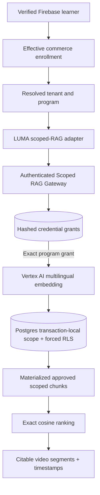

# LUMA-064 — Scoped Retrieval Backend: Architecture, Acceptance & Gate

Date: 2026-10-09. Branch: `feat/luma-064-scoped-rag`.

**VERIFIED in source/tests**: Backend code exists in `services/scoped-rag` and implements the LUMA scoped retrieval JSON contract. Access token HMAC digest is mapped to an explicit tenant/program grant in PostgreSQL; API checks rights before external embedding, then again before data retrieval. Database-enforced forced RLS and a materialized exact-ranking query constrain retrieval to approved source segments. Offline operator commands stage, human-approve and delete isolated content. Search cannot fall back to the global RAG index.

**VERIFIED with test infrastructure**: An isolated PostgreSQL 15 + pgvector database executed the migration successfully. Test identities in three tenant/program scopes show no cross-tenant data retrieval, and direct SQL against the read-only role returns no data without scope. Tests cover token/scope forgery, draft isolation, approved source, revoked token between validation and retrieval, and source deletion, as well as body-size and embedding safety. GitHub Actions provides an independent PostgreSQL/pgvector integration gate on the branch.

**NOT YET VERIFIED externally**: This is a new service, **not** an upgrade to the existing `luma-rag.textilesdemedellin.com` endpoint. No private Cloud SQL instance, service identity, secrets, Vertex model quota or real customer corpus has been configured here. Live source rights, permitted tenant ingestion, content provenance, deletion from backups, Cloud Run ingress, CI, load/latency, privacy and operational security remain outstanding.

## Logical data boundary

## Acceptance gates

| Gate | Current classification |
| --- | --- |
| API/body/request schema & early deny | VERIFIED (unit) |
| Bearer token authorized by tenant/program record | VERIFIED (local PostgreSQL integration) |
| Forced PostgreSQL RLS & read-only API role | VERIFIED (local PostgreSQL integration) |
| Pre-ranked tenant/program filtering | VERIFIED (SQL reviewed + local integration) |
| Draft, approval, source deletion | VERIFIED (local PostgreSQL integration) |
| Vertex 768-D embedding request/response | VERIFIED (mocked API) / NOT YET VERIFIED (live) |
| Matching LUMA TypeScript contract | Implemented; validate through PR CI |
| Real backend production deploy and secrets | NOT YET VERIFIED |
| Actual SE corpus ingest and rights approvals | NOT YET VERIFIED |
| Independent security reviewer/Granite critic | NOT YET VERIFIED |
| Load, backups, RTO/RPO, financial costs | NOT YET VERIFIED |
| Enterprise pilot activation | **BLOCKED** |

## Pilot activation criteria

Confirm client data ownership and right to index source material. Provision dedicated Cloud SQL and a least-privileged read-only database role. Stage one synthetic program and conduct authenticated cross-tenant tests against the *deployed* backend. Verify permissioned ingestion/deletion, signed media URL policy, secret rotation, Cloud Run request authentication perimeter, trace/alerting, cost and safe load. Obtain independent security review and release evidence. Only then enable the scoped-RAG environment and record the approval; do not disable the existing showcase during the transition.

## Intended deployment architecture

Cloud Run or an equivalent container runtime in `us-central1`, behind approved ingress/auth protection, with a private PostgreSQL instance supporting pgvector and a Vertex AI workload identity. **Source implementation is not proof of a deployed topology.**
