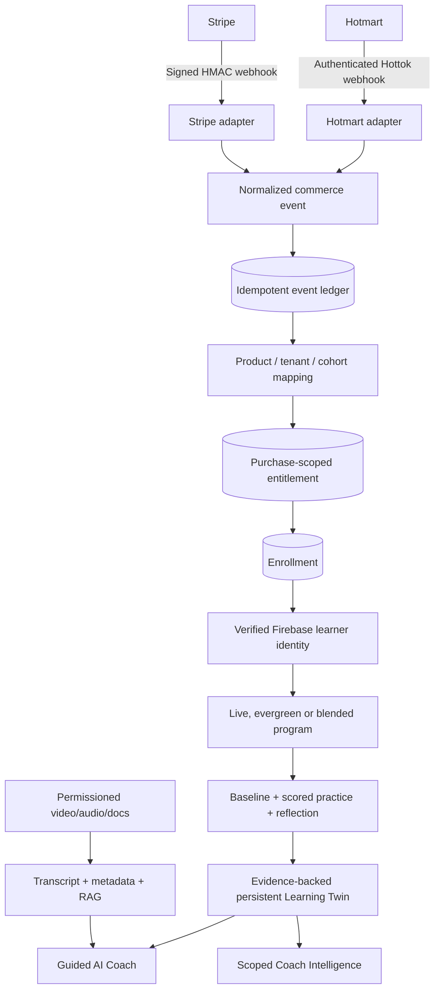

# LUMA — Solution Architecture

**Current implementation VERIFIED in repository; exact deployed topology and real provider activation NOT YET VERIFIED.**

## Security and operations boundaries

- Provider authentication happens before normalized events; webhook payloads do not belong in the learning domain.
- State mutations use Firebase Admin; repository Firestore client rules deny all direct reads/writes.
- Purchase identity = tenant + customer + canonical product + stable purchase key. One refund cannot affect a separate purchase.
- Verified-email access claim binds a commerce enrollment to a Firebase user. Authenticated onboarding initializes `learners/{uid}`; purchase alone does NOT produce fabricated learning mastery.
- Live-cohort offering assignments, timezone-aware schedule and optional recording are independent of content playback.
- Coach APIs enforce claims/scope. Commerce mapping and trace APIs use **global admin authorization**, not tenant-self-service.
- App Hosting code config: CPU 1, memory 512 MiB, min 0 / max 2 instances, HTTP concurrency 80. This is NOT a measurement of active learners.

## Current vs target

**Current pilot:** Next.js, Firebase Auth, Firestore ledger/enrollment, AI + optional RAG/voice service boundaries, demo surfaces.

**Target production:** measured concurrency, provider sandbox receipts, settlement/reconciliation operational plan, tenant-specific privacy controls on all real-data surfaces, alerting, backup/restore rehearsal, RTO/RPO based on proof, retention and AI handling agreement.

**Blocking privacy caveat:** `/studio/learners/mariana` publicly displays example Twin evidence. It must remain fictional; real participant data requires server-side tenant-and-coach authorization on every UI/export path before launch.

## Enterprise tenant/program isolation (2026-10-09)

When opt-in `entitled` mode is enabled, authenticated learner and coach APIs resolve a current program-scoped entitlement and use `learningTenants/{tenantHash}/learningPrograms/{programHash}/learners/{uid}` (SHA256 of identifiers) rather than reading demo/legacy `learners/{uid}`. The scope also controls the dedicated RAG gateway; mixed-scope responses are rejected without querying the shared index. The RAG backend must still demonstrate pre-retrieval index isolation independently. See `tenant-isolation-contract.md` and `specs/064-tenant-program-learning-isolation.md`. The enterprise pilot remains gated.
