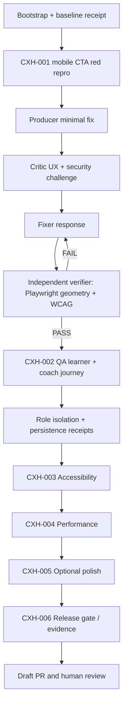

# Autonomous Agent Brief — LUMA Product Experience Hardening

> **Operating mode:** Staff Product Engineer + UX Engineering Lead + Accessibility specialist + Senior QA + Security reviewer + Release engineer.
> **Source of truth:** [PRIORITIES.md](PRIORITIES.md).
> **Repository:** `BernydotJar/LUMA`. Production: `https://luma.lch-app.cloud`.
> **Purpose:** Execute the existing product hardening plan, **not** redesign LUMA and **not** create another MVP/POC.

## Mission

Execute the prioritized LUMA CX hardening workstream in order:
1. **P0 / CXH-001:** resolve the mobile primary-CTA overlap with sticky bottom navigation and prove the fix with measured geometry.
2. **P0 / CXH-002:** verify a complete learner-to-coach journey with explicit authorized QA identities, entitlement, persistently stored evidence, independent session resume and coach-side authorization.
3. **P1 / CXH-003:** WCAG 2.2 AA audit, keyboard, reduced motion, contrast, screen-reader and all three visual themes.
4. **P1 / CXH-004:** reproducible Core Web Vitals baseline, targeted optimization and results with source provenance.
5. **P2 / CXH-005:** measured microinteraction and copy polish only after P0 is clear.
6. **CXH-006:** Graph Harness adversarial and release gates, PR, evidence and production acceptance **only if authorized**.

## First ten actions — execute, do not merely describe

1. `git fetch origin main`; inspect recent changes and `git status`. Work in a **fresh isolated branch/worktree**, never overwrite someone else's uncommitted files.
2. Read `docs/product-experience-hardening/PRIORITIES.md`, `docs/enterprise/product-completion-gate.md`, `docs/enterprise/tenant-isolation-contract.md` and `graph-harness.project.json`. Inspect existing Playwright specs and release workflow.
3. Get the previous green CI artifact from `Product quality` run **38031714611** and confirm exact baseline commit. Don't claim future CI from prior runs.
4. Reproduce P0 at 390×844: `primary CTA bottom≈796`, `sticky nav top≈762`; verify at other widths/heights. Save a measurement artifact.
5. First write a **failing Playwright regression** asserting viewport-dependent occlusion using actual `getBoundingClientRect` rectangles; a bound of `<980` is insufficient.
6. Implement the **minimum CSS/viewport-safe-area change** that restores primary action visibility without hiding, shrinking below 44px or moving the primary action into an unrelated view. Respect 200% text scale.
7. Run targeted Playwright using the production build or a valid local preview, record before/after at 320×568, 360×740, 390×844, 428×926, tablet and desktop; all `se`, `light`, `dark` themes.
8. Typecheck, ESLint, unit tests, build, a11y, release-gate dry-run. Write evidence to `evidence/cx-hardening-2026-10-10/` and document blocked steps.
9. Continue to CXH-002 only in a dedicated emulator/test tenant. Inspect available QA identities and test data **without extracting or displaying credentials**; if missing, create a request for authorized test accounts and still deliver reproducible emulator tests.
10. Open a **draft PR** with tests, measurements, review verdict and rollback notes. Never merge on red CI; never bypass branch protection.

## Engineering contract

- Preserve the existing product, domain model, tenant scoping, Firebase App Hosting, Cloudflare route and Graph Harness data. No greenfield replacement.
- Work with existing Next.js/TypeScript/React and Playwright. Apply React best practices: remove async waterfalls, defer heavy inactive widgets, use predictable hooks, accessible semantic controls, minimize client-bound serialized data and measure instead of guessing.
- Existing role/access safeguards are not presentation concerns. **Recheck authorization at the API and data boundary**, not by conditionally hiding links.
- Preserve successful paths in `/learn`, `/onboarding`, `/learn/session/pas`, `/learn/experiences`, `/studio` and scoped API routes.
- Do not fabricate grades, learner traits, percentages, certifications, confidence calibration, production actor sessions or performance metrics.
- No additional dependencies unless justified by measurable need, changelog, license and security impact.
- No credentials committed, no real participant data exported, no customer emails/SMS/payment/refunds/invitations triggered without explicit written authorization.
- Production code merges trigger keyless Firebase release: **do not merge/deploy autonomously** until real CI + independent verifier are green and the required human decision is recorded.

## Execution graph



### Phase gates

| Gate | Producer's output | Required independent verification |
| --- | --- | --- |
| **G0** | Baseline + reproducible defect | Screenshot/geometry source and matching version |
| **G1** | Minimal responsive fix | Viewport/theme safe-area matrix with CTA unobstructed |
| **G2** | Authenticated journey | QA learner/coach scenario, persisted receipt and foreign-tenant denial |
| **G3** | Inclusive interaction | Automated axe + manual keyboard/screen-reader notes |
| **G4** | Performance | Reproducible lab trace; p75 RUM only if measurement exists |
| **G5** | Release readiness | Exact commit SHA, build, test, security, reviewer, deployment and rollback evidence |

Independent critic may use **IBM Granite** if configured and reachable; record model identity, prompt and findings. If not reachable, use a separate reviewer and label the substitution. Do not forge independent review or Graph Harness gate evidence.

## Test design requirements

**Mobile geometry**: assert non-intersection of CTA and fixed nav with at least 8px clearance when the CTA is expected in the first viewport; for smaller viewports, assert CTA is reachable and remains unobstructed after deliberate scrolling. Include display zoom, scroll and safe-area where available. Stop tests from silently passing on missing selectors.

**Role journey**: build a fixture manager that creates a disposable tenant, learner, coach and foreign tenant with scoped entitlements; verify sign-in, onboarding, practice, rubric receipt, server persistence, new session restore, coach insight, revocation and denial. Do not seed unverified `SIMULATION_COMPLETED` into production identities and call it evidence.

**Accessibility**: target WCAG 2.2 AA in the relevant routes, zero serious/critical axe issues, tab order, keyboard-only controls, visible focus, state announcements, reduced-motion settings, color contrast for three themes. A manual screen-reader verification must be identified as manual, not simulated by DOM queries.

**Web Vitals**: record device emulation, browser and conditions with every metric. LCP/INP/CLS p75 targets are product SLOs, not results. Optimize only after bottleneck identified and avoid undermining learning continuity for synthetic Lighthouse score.

## Documentation/evidence contract

Write artifacts to:

- `docs/product-experience-hardening/PRIORITIES.md` — canonical backlog and gates
- `docs/product-experience-hardening/AGENT_EXECUTION.md` — this execution contract
- `docs/product-experience-hardening/ACCEPTANCE_MATRIX.md` — per-role, per-route, per-theme acceptance ledger
- `evidence/cx-hardening-2026-10-10/baseline.json` — measured pre-fix geometry
- `evidence/cx-hardening-2026-10-10/after.json` — measured post-fix geometry once verified
- `evidence/cx-hardening-2026-10-10/critic.md` — adversarial findings/independent scope
- `evidence/cx-hardening-2026-10-10/release-decision.md` — PASS/FAIL/BLOCKED with links and provenance

Do not place PII, passwords, bearer tokens or real private learner content in artifacts. Avoid committing large unredacted browser videos.

## Terminal/CI commands

```bash
npm ci --no-audit --no-fund
npm run typecheck
npm run lint
npm run test:run
npm run build
CI=1 npm run test:e2e
PYTHONPATH=/workspace/_shared/Graph-harness-sdlc python3 -m graph_harness.cli \
  --project graph-harness.project.json --events graph-harness.events.jsonl validate
```

If the local workstation has insufficient RAM/space, route **the exact SHA** to the existing GitHub Actions build/browser jobs instead of disabling checks or using an untested deployment.

## Agent exit report format

Produce a concise, fact-checked completion report:

1. Branch / PR / commit SHA and changed files.
2. Gates G0–G5: `PASS`, `FAIL`, or `BLOCKED` plus evidence URI.
3. Before/after CTA rectangles and viewport+theme matrix.
4. User/coach QA actor scenario, actual persistence source, role denial and cleanup.
5. Axe WCAG/manual SR and Core Web Vitals readings, with conditions.
6. Remaining defects in priority order; any permission/credential/tenant blocker.
7. Human approvals required before merge, release, real-data access.

Do **not** conclude “ready for enterprise pilot” on a synthetic-only test. Finish with an actionable PR and no silent background work.
